# Campus Pulse

## Android Club Technical Recruitment Task 2026

**Developed by:** Himanshu Singh

---

# Project Overview

Campus Pulse is a smart campus visibility and navigation platform built to improve communication and accessibility within a college environment.

Students often spend time searching for faculty members, locating friends across campus, or navigating through crowded areas. Faculty members may be available, in class, attending meetings, or occupied elsewhere, but students typically have no easy way of knowing their current availability.

Campus Pulse addresses these challenges by combining real-time location tracking, teacher availability management, friend connectivity, crowd monitoring, and navigation support into a single mobile application.

The goal of the project was to create a practical application that could enhance the daily campus experience while demonstrating mobile application development skills using Flutter.

---

# Features Implemented

## User Authentication

* User Registration
* User Login
* College Email Validation
* Role-Based Access (Student / Teacher)

---

## Teacher Availability Management

Teachers can update their current status, allowing students to know whether they are available.

Supported statuses:

* Available
* In Class
* In Meeting
* Lunch Break
* In Office
* Not Available

---

## Teacher Finder

Students can search for faculty members and check their availability.

Features:

* Teacher Search
* Availability Status Display
* Live Teacher Location Access
* Navigation to Available Teachers

---

## Live Campus Map

An interactive Google Maps interface displays campus activity in real time.

The map displays:

* Friends
* Teachers
* Students

Marker Categories:

* 🟢 Green Markers – Friends
* 🔵 Blue Markers – Teachers
* 🔴 Red Markers – Students

---

## Friend System

Users can connect with other students through a friend request system.

Features:

* Search Users using Register Number
* Send Friend Requests
* Accept Requests
* Reject Requests
* Manage Friends List

---

## Friend Location Tracking

Users can view the live location of accepted friends.

Features:

* Friend Location Display
* Interactive Map View
* Direct Navigation Support

---

## Crowd Monitoring

Campus Pulse includes a crowd visibility feature that helps users understand activity levels around campus.

Features:

* Crowd Density Visualization
* Campus Activity Monitoring
* Improved Campus Navigation

---

## Navigation Support

Integrated Google Maps navigation allows users to quickly obtain directions to:

* Friends
* Available Teachers

with a single tap.

---

## Real-Time Location Updates

The application periodically updates user locations to ensure that displayed information remains current and accurate.

---

# Technology Stack Used

### Frontend

* Flutter
* Dart

### Backend & Database

* Supabase

### Maps & Location Services

* Google Maps Flutter
* Geolocator
* URL Launcher

### Development Tools

* VS Code
* Git & GitHub

---

# Setup Instructions

### Quick Evaluation

An APK build has been attached in GitHub Releases and can be installed directly on an Android device for testing.

### Running the Source Code

1. Clone the repository
2. Install dependencies using:

```bash
flutter pub get
```

3. Configure Supabase credentials
4. Run the application:

```bash
flutter run
```

---

# Screenshots of the Application

## Login Screen
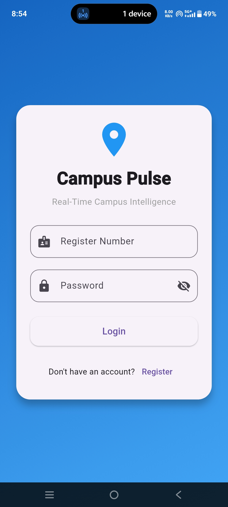

## Registration Screen
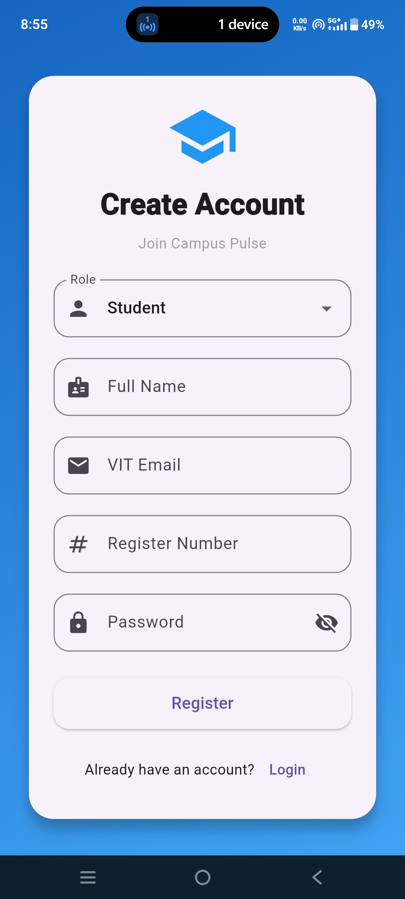

## Home Screen
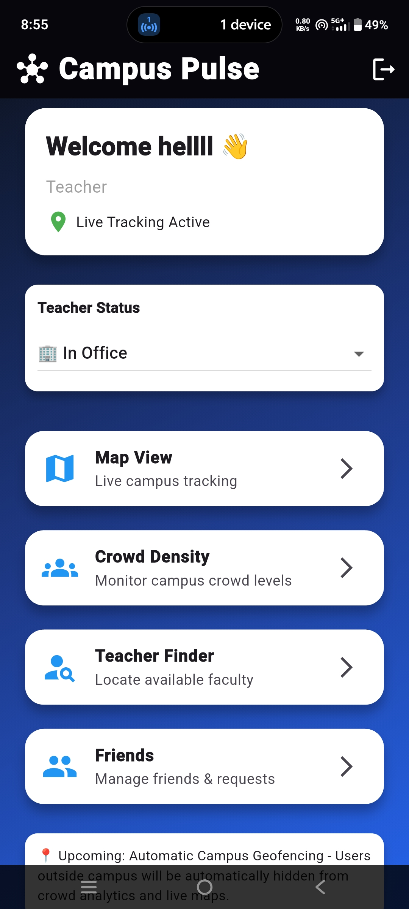
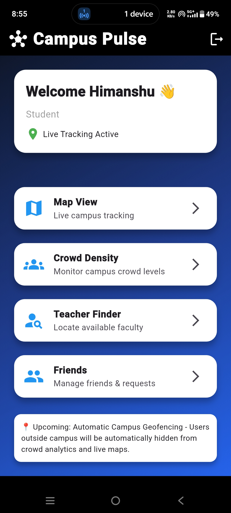

## Teacher Finder
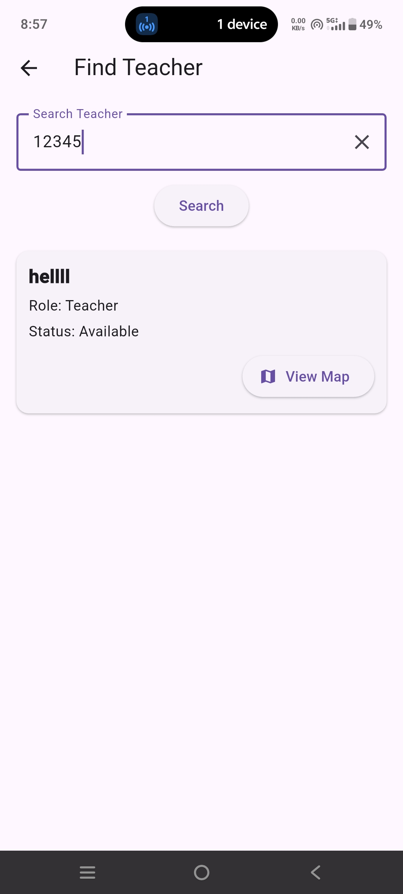

## Friends Module
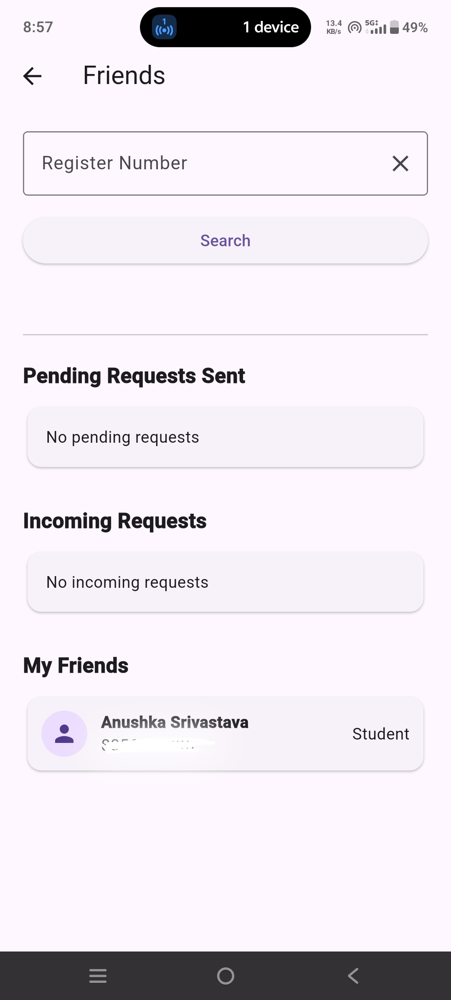

## Campus Map
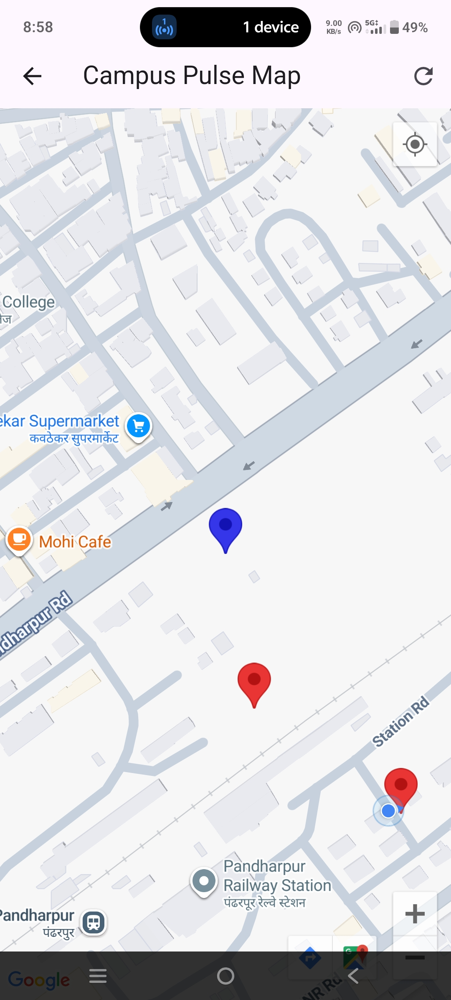
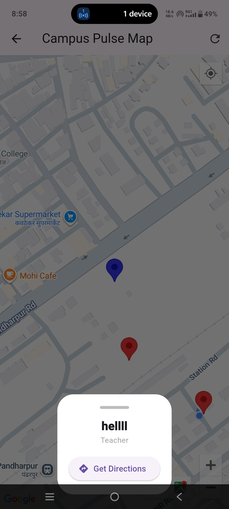

## Crowd Monitoring
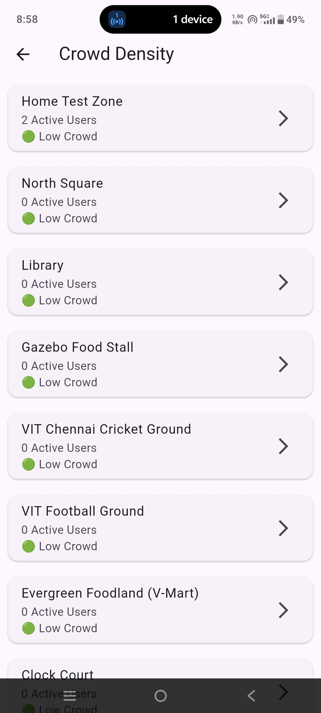
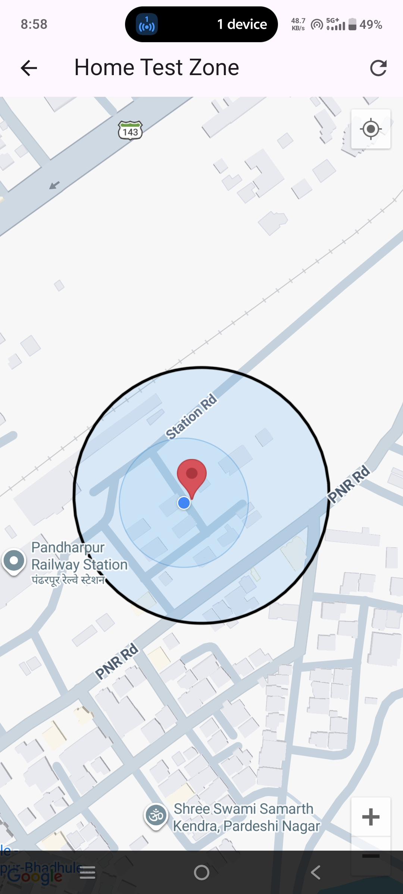

## Navigation Support
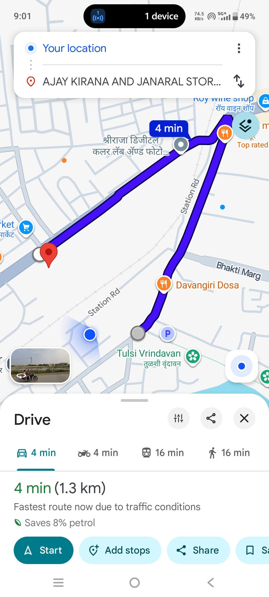

---

# Demo Video

A demonstration video showcasing the application's major features has been included with the submission.

The video covers:

* User Registration
* Login Flow
* Teacher Finder
* Teacher Status Updates
* Friend Requests
* Friend Location Tracking
* Crowd Monitoring
* Live Campus Map
* Navigation Support

---

# Project Structure

```text
lib/
├── screens/
├── services/
├── widgets/
├── models/
└── main.dart
```

The project follows a modular structure where screens, services, and business logic are separated to improve maintainability and scalability.

---

# Future Scope

While the current version of Campus Pulse successfully demonstrates the core functionality, several practical improvements can be added in future versions:

Automatic Campus Geofencing: Users who leave the campus area can be automatically hidden from the live map and crowd analytics, ensuring that only active on-campus users are displayed.
Background Location Updates: Location updates can continue in the background, allowing more accurate real-time tracking even when the application is minimized.
Teacher Status Notifications: Students can receive notifications when a teacher changes their status to "Available", making it easier to know when a faculty member can be approached.

These enhancements would improve the overall user experience and make Campus Pulse more suitable for real-world campus deployment.

---

# Conclusion

Campus Pulse demonstrates the use of real-time location services, authentication, mapping technologies, and social connectivity within a campus environment.

The project focuses on solving practical student and faculty challenges while maintaining a clean user interface, modular architecture, and scalable design. It serves as a foundation for a larger campus management and navigation platform that can be expanded further in the future.
